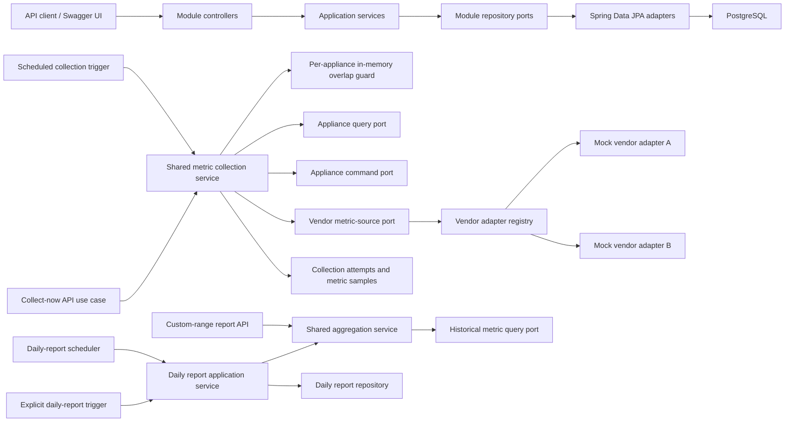

# Connected Appliance Platform — Architecture

## 1. Summary, goals, and constraints

Build one locally runnable Java 17/Spring Boot 3 modular monolith backed by PostgreSQL. It exposes DTO-based REST APIs, collects metrics through scheduled and explicit “collect now” use cases, normalizes mock-vendor readings, retains historical data, and generates daily and custom-range reports.

The approved stack is Java 17, Spring Boot 3, Maven, PostgreSQL, Flyway, Spring Data JPA, Spring Scheduler, Springdoc OpenAPI, Spring Boot Actuator, JUnit 5, Mockito, and test-only Testcontainers PostgreSQL. The technology stack and architecture are approved project design decisions, not original assignment requirements.

Spring Boot Actuator is included only for lightweight local health and operational visibility. The security-hygiene and observability choices in this document are supporting engineering decisions, not original assignment requirements.

Architecture goals:

- Correct, maintainable, and easily reviewed end-to-end behavior.
- Clear feature-module ownership and dependency direction.
- Durable schedules, historical metrics, collection outcomes, and daily reports.
- Deterministic automated tests against actual PostgreSQL.
- Easy addition of vendor adapters without changing common appliance behavior.
- Short database transactions with vendor calls performed outside them.
- UTC timestamps and report boundaries throughout.
- Minimal operational complexity suitable for one application instance.

Constraints:

- One application instance and one PostgreSQL database.
- Logical feature modules within one Maven/Spring Boot application.
- Controllers never access repositories.
- Public APIs use DTOs; persistence entities remain internal.
- Vendor-specific fields remain in vendor-owned code or future vendor-owned configuration.
- No detailed endpoint paths, DTO payloads, or database tables are defined yet.

## 2. High-level structure and flow

Collection flow:

1. Scheduled and manual triggers invoke the same metric-collection application service.
2. The service reads appliance collection state through the public Appliance query port and attempts to acquire its in-memory overlap guard.
3. It resolves the vendor adapter and performs vendor I/O without an open database transaction.
4. The adapter normalizes vendor-native readings into canonical metrics.
5. In one short transaction, the service persists the Metrics-owned collection attempt and valid samples, then updates the Appliance-owned consecutive-failure state, last collection status, and next-collection-due state through the public Appliance command port.
6. The overlap guard is released in a `finally` path.

Report flow:

1. Both daily and custom-range reports use the same aggregation service.
2. The aggregation service reads historical metrics and produces an in-memory result.
3. Daily results are persisted idempotently and remain retrievable.
4. Custom-range results are returned synchronously without persistence.

## 3. Modular-monolith boundaries

Use feature-first modules, each containing API, application, domain, and infrastructure packages where applicable.

| Module | Ownership | Permitted dependencies |
|---|---|---|
| Appliance | Registration, common metadata, lifecycle status, collection interval, next-collection-due state, consecutive-failure state, and last collection status | Shared types; declares supported-vendor port and public collection-state query and command ports |
| Metrics | Scheduled and manual collection orchestration, per-appliance overlap protection, collection attempts, normalized metric samples, and historical metric queries | Appliance public query and command contracts; shared types; declares vendor-metric port |
| Vendor integration | Adapter SPI, adapter registry, mock adapters, native-to-canonical conversion, typed vendor failures | Public outbound-port contracts from appliance and metrics; shared types |
| Reporting | Shared aggregation, automatic daily generation, persisted daily results, synchronous custom-range results | Metrics public query contract; shared types |
| Bootstrap/shared | Spring composition, configuration, UTC `Clock`, common errors and identifiers | May wire all modules; contains no feature business rules |

Dependency rules:

- Modules communicate through public application/query ports, never another module’s repository or JPA entity.
- Metrics reads appliance lifecycle and scheduling state through the public Appliance query port and updates appliance scheduling and failure state only through the public Appliance application command port.
- Metrics must never access the Appliance repository or JPA entity directly.
- The collection application service may coordinate Metrics persistence and Appliance state updates in one short transaction because the modular monolith uses one application process and one PostgreSQL database.
- Appliance and metrics declare the vendor-facing ports they require; vendor integration implements them.
- Reporting depends on the metrics query contract rather than metric persistence.
- Controllers call application services only.
- The composition root wires port implementations.
- Use one Maven application for review simplicity; package visibility and architecture tests protect logical boundaries.

## 4. Appliance registration and management

The common appliance model contains only vendor-neutral information: identity, display metadata, vendor key, opaque external appliance reference, lifecycle status, collection interval, next-collection-due state, consecutive-failure state, and last collection status.

Supported management operations:

- Register.
- Get.
- List.
- Update common display metadata.
- Update collection interval.
- Pause collection.
- Resume collection.

Behavioral rules:

- Registration verifies that the vendor key resolves to exactly one adapter.
- Vendor key plus external appliance reference uniquely identifies a registration.
- New appliances begin active and eligible for collection.
- Vendor identity is immutable after registration.
- Updating the interval recalculates the next scheduled collection using the common scheduling policy.
- Pausing prevents scheduled and manual collection while preserving history and daily reports.
- Resuming makes the appliance eligible for prompt collection.
- Physical deletion is an explicit non-goal because historical metrics and daily reports must remain meaningful.

## 5. Vendor adapters, mocks, and normalization

### Adapter abstraction and selection

The internal adapter contract provides:

- A stable vendor key.
- A collection operation using a vendor-neutral appliance reference.
- Canonical readings or typed vendor failure information.
- Warnings for partially usable responses.

A Spring-injected registry indexes adapters by vendor key. Duplicate keys fail startup; unsupported keys are rejected during registration. Vendor-specific selection logic must not appear in controllers or collection services.

Future credentials or vendor-specific connection properties belong to vendor-owned models. They must not become generic appliance fields or an unstructured property bag in the common domain.

### Mock vendors

Provide at least two deterministic in-process adapters demonstrating:

- Different native metric names.
- Different native units requiring conversion.
- Different latency, rate-limit, and failure behavior.
- Stable values suitable for repeatable tests.

Fault behavior should be controllable through local/test configuration rather than vendor-specific appliance fields.

### Metric normalization

Adapters translate native readings into a small canonical catalog before returning them. Initial metrics should be numeric gauges, represented with `BigDecimal` and one canonical unit per metric.

Normalization rules:

- Native names and units do not enter the common metric model.
- Conversion is owned and tested by the adapter.
- Valid readings become canonical samples.
- Unknown readings are omitted and recorded as warnings.
- Malformed values or incompatible units are not persisted.
- Some valid readings produce a partial-success attempt.
- No valid readings produce a failed attempt.
- Reports operate only on canonical names and units.

## 6. Scheduled and manual metric collection

### Shared collection service

Scheduled collection and “collect now” must call the same application service and therefore share:

- Appliance eligibility checks.
- Per-appliance overlap protection.
- Adapter lookup and invocation.
- Timeout and failure classification.
- Normalization.
- Attempt and sample persistence.
- Failure-state updates.
- Next-due calculation.

The trigger source may be recorded for diagnostics, but it must not select a separate logic path.

### Scheduled collection

- A configurable Spring Scheduler tick queries PostgreSQL for active appliances whose next-due time has passed.
- Next-due state is durable so scheduling survives restart.
- The scheduler does not claim appliances in the database before vendor I/O.
- If an appliance is already being collected in memory, the scheduled trigger skips it and leaves it eligible for a later tick.
- Vendor calls execute through a small bounded executor with configured timeouts.
- A completed attempt updates attempt history, valid samples, failure state, and next-due time in one short transaction.

### Collect-now use case

- The API exposes an explicit application use case for collecting one registered appliance immediately.
- It remains subject to active/paused state and the same overlap guard.
- If collection is already running, the use case returns a clear busy/conflict outcome rather than starting another call.
- The response communicates the resulting collection outcome through a DTO without exposing persistence entities.
- A manual attempt resets the next scheduled collection time using the same post-attempt scheduling policy, avoiding an immediate duplicate scheduled poll.
- This is a reviewer-verification aid and does not replace configurable scheduling.

### Single-instance overlap coordination

Use a keyed, per-appliance in-memory guard:

- Acquisition occurs immediately before vendor interaction.
- Release occurs reliably after success or failure.
- No database lock or claimed status is written before the call.
- Vendor I/O occurs without a database transaction.
- Persistence occurs only after the call in a short transaction.

If the process stops during collection, its in-memory guard disappears and next-due state has not been advanced. The appliance therefore remains eligible after restart. This favors simple at-least-once scheduling over distributed coordination, which is unnecessary for the approved single-instance scope.

## 7. Historical persistence and failure handling

### Historical metrics

- Metric samples are append-only.
- Each sample retains appliance identity, canonical metric and unit, numeric value, observation time, ingestion time, and originating attempt.
- All timestamps are UTC.
- History queries support appliance and UTC time-range filtering.
- Automatic retention deletion is not included.

### Collection attempts and failure state

Persist a collection attempt for each completed invocation, including timing, trigger source, outcome, warnings, failure category, and sample count.

Typed failure handling:

- Timeout or transient failure: persist failure and calculate a capped exponential-backoff next-due time.
- Rate limit: honor retry-after information when available; otherwise use transient backoff.
- Invalid vendor data: persist valid readings only and record partial or failed status.
- Unsupported vendor: prevent registration.
- Unexpected failure: persist a sanitized internal category and log diagnostics.
- Success: reset consecutive-failure state and schedule the next normal interval.

Failures do not deactivate appliances, erase historical data, or create placeholder samples. Immediate retry loops, circuit breakers, and additional resilience frameworks are intentionally omitted.

## 8. Daily and custom-range reporting

### Shared aggregation service

One aggregation service accepts a validated UTC time range, reads normalized history, and produces summaries grouped by appliance and canonical metric.

Initial summaries contain:

- Sample count.
- Minimum.
- Maximum.
- Average.
- Canonical unit.

Reports do not contact vendors, synthesize missing values, or reinterpret vendor-native data.

### Daily reports

- Represent the previous UTC calendar day using `[start, end)` boundaries.
- Are generated automatically through an idempotent scheduled application service.
- May also be explicitly generated for a UTC date for Swagger-based verification.
- Persist one immutable result per UTC day.
- Can be listed or retrieved later.
- Have no asynchronous job or status model.
- If generation fails before persistence, no completed daily report exists and a later scheduled or manual invocation can retry.
- Concurrent attempts rely on a database uniqueness invariant to preserve idempotency.

### Custom-date-range reports

- Accept a UTC start and end instant.
- Use start-inclusive, end-exclusive boundaries.
- Reject missing, equal, or reversed boundaries.
- Aggregate synchronously and return the result directly.
- Are not persisted.
- Return a valid empty result when no samples exist.
- Have no job identifier or status lifecycle.

Detailed report DTOs and physical persistence structure remain deferred.

## 9. Layer and persistence responsibilities

### API layer

- Own public request and response DTOs.
- Perform structural validation.
- Translate application outcomes into HTTP responses.
- Use centralized Spring `ProblemDetail`-style errors.
- Publish contracts through Springdoc OpenAPI.
- Expose appliance management, collect-now, metric history, collection outcomes, daily reports, and custom-range reports.
- Never expose JPA entities or call repositories.

### Application services

- Implement individual use cases and orchestration.
- Enforce domain rules and eligibility checks.
- Define transaction boundaries.
- Coordinate adapter calls, persistence, aggregation, and scheduling.
- Use an injected UTC `Clock`.
- Avoid vendor-specific parsing and transport details.

### Repositories and PostgreSQL

- Each module owns its repository interfaces and Spring Data JPA implementations.
- Flyway is the sole schema-evolution mechanism.
- Hibernate validates mappings rather than creating the application schema.
- Database constraints enforce identity and daily-report idempotency invariants.
- Indexes support due-appliance scans and appliance/time-range history queries.
- Cross-module queries use public query ports.
- Vendor calls never occur inside database transactions.

### High-level domain entities and value types

- Appliance module — `Appliance`: common identity and metadata, lifecycle status, collection interval, next-collection-due state, consecutive-failure state, and last collection status.
- Metrics module — `CollectionAttempt`: trigger source, timing, outcome, warnings, failure category, and sample count.
- Metrics module — `MetricSample`: canonical reading and UTC observation/ingestion metadata.
- `DailyReport`: UTC day/window, generation time, and immutable aggregation result.
- `AggregationResult`: non-persistent result used by both daily and custom reporting.
- Value types/enums: identifiers, vendor key, appliance status, canonical metric/unit, trigger source, collection outcome, failure category, and UTC time range.

These remain conceptual entities; no database tables or public payloads are defined here.

## 10. Security and configuration baseline

- Client authentication and authorization are not implemented because the assignment defines no users, roles, ownership, or access-control requirements.
- This local-review API must not be presented as production-secure.
- In a production deployment, authentication would be delegated to an external identity provider using OAuth2/OIDC. The backend would act as a resource server and validate JWT access tokens rather than implementing its own login, password storage, or token issuance.
- All public request DTOs, path parameters, query parameters, collection intervals, and report ranges must be validated.
- Validation and application failures must be returned through sanitized `ProblemDetail`-style responses.
- API responses must not expose stack traces, SQL details, internal exception class names, database identifiers, or vendor-client implementation details.
- Database credentials and configurable secrets must be supplied through environment variables or external configuration. Real secrets must never be committed to the repository.
- Any sample configuration must contain placeholders or safe local defaults only.
- Logs must not contain credentials, access tokens, database passwords, raw vendor payloads, or other sensitive configuration.
- Use JPA or parameterized database operations. Do not construct SQL queries using untrusted request values.
- Do not enable unrestricted CORS unless a later approved client requirement needs it.

## 11. Lightweight observability

- Expose the Spring Boot Actuator health endpoint so a reviewer can verify that the application and PostgreSQL database are available. The health response must not expose sensitive configuration or unnecessary internal details.
- Expose only the Actuator web endpoints needed for the approved local-review scope; additional management endpoints require explicit approval.
- Use structured, meaningful application logs.
- Accept or generate a request-correlation identifier for API requests. The exact HTTP header behavior will be defined in `API_CONTRACT.md`.
- Include relevant identifiers and outcomes in logs, such as appliance ID, vendor key, collection-attempt ID, trigger source, report date, outcome, and duration.
- Do not log sensitive configuration or complete vendor payloads.
- Log collection start, completion, partial success, timeout, rate-limit, and failure events.
- Log daily-report generation start, completion, idempotent reuse, and failure events.
- Persisted collection attempts remain the primary business audit trail for metric-collection outcomes.
- Use basic Micrometer counters and timers for:
  - successful collections;
  - partial collections;
  - failed collections;
  - vendor timeouts;
  - rate-limit responses; and
  - report-generation duration.
- Prometheus, Grafana, Elasticsearch, OpenTelemetry infrastructure, other external monitoring platforms, and production alerting remain explicit non-goals.

## 12. Important decisions and trade-offs

| Decision | Recommended option | Alternatives considered | Suitability and trade-off |
|---|---|---|---|
| Deployment | One modular monolith and PostgreSQL | Microservices; separate workers | Simple local execution and debugging. Not designed for independent scaling. |
| Module packaging | Feature packages in one Maven application | Maven submodules; Spring Modulith | Reduces project ceremony. Boundaries need visibility rules and tests. |
| Collection triggers | Scheduler and collect-now share one service | Separate manual collection implementation | Makes verification easy without duplicating behavior. Manual collection resets the next due time. |
| Coordination | PostgreSQL next-due state plus in-memory overlap guard | Database claims; distributed locks | Restart-safe and easy to reason about for one instance. It is unsuitable for multi-instance deployment. |
| Vendor selection | Injected adapter registry | Controller/service conditionals | Extension is localized and testable. Adapter keys require uniqueness validation. |
| Normalization | Convert inside each adapter | Persist raw data and normalize later | Keeps vendor details isolated and reporting simple. Raw payloads cannot be reprocessed later. |
| Metric history | Immutable normalized PostgreSQL samples | In-memory history; JSON blobs | Durable and queryable. Requires database migrations and local PostgreSQL. |
| Daily reporting | Persist immutable, idempotent daily results | Recompute on every request; asynchronous jobs | Supports retrieval and clear verification. Late-arriving historical data does not automatically rewrite an existing daily snapshot. |
| Custom reporting | Synchronous and non-persistent | Persist every report; asynchronous jobs | Minimal lifecycle and immediate reviewability. Large ranges may be slow at scales outside this assignment. |
| Daily boundary | UTC `[start, end)` window | Local or configurable timezone | Deterministic and consistent. May differ from an unstated business timezone. |
| Failure recovery | Typed failures and scheduled backoff | Inline retries; queues; circuit breakers | Dependency-light and observable. Not production-grade distributed resilience. |
| Integration database tests | Testcontainers PostgreSQL | H2; shared local test database | Tests real PostgreSQL, Flyway, and JPA behavior in isolation. Full verification requires Docker. |
| Authentication | Current implementation: no authentication. Production extension: external identity provider using OAuth2/OIDC with JWT resource-server validation. | Basic auth; application-managed login, password storage, or token issuance | Simple reviewer access, but the local API is not suitable for public deployment. |
| Observability | Actuator health, structured logs, correlation IDs, persisted collection attempts, and basic Micrometer metrics | Prometheus/Grafana, centralized logging, and distributed tracing | Sufficient local visibility without additional infrastructure, but not production-grade monitoring. |
| Local database | Minimal Docker Compose or manual PostgreSQL | Embedded database; fully containerized application | Preserves PostgreSQL behavior while allowing Maven-based app debugging. |

## 13. Testing and reviewer verification

Testing layers:

- Unit tests for appliance lifecycle, interval changes, overlap handling, next-due calculations, time-range validation, aggregation, normalization, and backoff behavior.
- Mockito application-service tests covering scheduled and manual triggers through the same collection service.
- Adapter contract tests for every mock vendor.
- MVC/API tests for DTO validation, error translation, collect-now behavior, and controller-to-service boundaries.
- Testcontainers PostgreSQL integration tests for Flyway, JPA mappings, repositories, due scans, history queries, atomic attempt persistence, and daily-report idempotency.
- Scheduler tests using a controlled `Clock` and direct coordinator invocation rather than wall-clock waits.
- Health-endpoint verification showing that the application and PostgreSQL database are available.
- Error-response tests confirming that validation and application failures are sanitized and do not expose stack traces, SQL details, or internal exception types.
- Request-correlation tests covering accepted and generated identifiers once the HTTP header contract is approved.
- API validation tests for collection-interval bounds and custom and daily report ranges.
- Focused logging or Micrometer instrumentation tests where practical, without making tests depend on exact log-message text.
- End-to-end Spring Boot tests covering:
  - Register and collect now.
  - Scheduled collection.
  - Normalized historical retrieval.
  - Pause and resume.
  - Vendor timeout, rate limit, and partial data.
  - Synchronous custom reporting without persistence.
  - Idempotent daily generation and later retrieval.
  - Restart eligibility semantics around unchanged next-due state.

`mvn verify` should automatically create an isolated PostgreSQL test database through Testcontainers when Docker is available. Unit-only verification and Docker prerequisites should be documented separately.

Local reviewer path:

1. Start PostgreSQL using Docker Compose or a documented manual installation.
2. Run the application with Maven; Flyway applies migrations.
3. Check the Actuator health endpoint and verify that the application and database are available.
4. Open Swagger UI and register a mock-vendor appliance.
5. Invoke collect now and inspect the persisted collection outcome.
6. Query normalized metric history immediately.
7. Configure a short interval and verify scheduled collection still occurs.
8. Pause and resume collection and observe the effect.
9. Generate a custom-range report and receive it directly.
10. Generate and retrieve a daily report for a UTC date.
11. Run `mvn verify` with Docker to execute isolated PostgreSQL integration tests.

Seed data remains optional and disabled by default. Small documented requests may be provided solely to shorten reviewer verification.

## 14. Explicit non-goals

- Physical deletion of appliances.
- Real appliances, vendor APIs, or hardware integrations.
- Cisco-specific products, protocols, package names, infrastructure, or domain behavior.
- Implementation of client authentication and authorization for the
  local take-home solution.
- Real vendor credential management.
- UI or mobile applications.
- Kafka, Redis, Kubernetes, microservices, cloud infrastructure, or distributed scheduling.
- Multiple application instances or distributed overlap coordination.
- Production-scale throughput, high availability, or disaster recovery.
- Vendor-specific fields in the common appliance model.
- Raw vendor-payload retention.
- Automatic historical-data or daily-report deletion.
- Persisting custom-range reports.
- Asynchronous report jobs or report status models.
- Downloadable report files, dashboards, or delivery channels.
- Production-grade observability, external monitoring and alerting infrastructure, authentication infrastructure, or compliance certification.

These non-goals do not exclude the basic security hygiene, Actuator health checks, structured logging, request correlation, and application-level Micrometer metrics defined above.

## 15. Assumptions and unresolved decisions

Approved assumptions and design choices:

- Exactly one application instance is supported.
- PostgreSQL data survives application restarts.
- Appliance management consists of register, get, list, display-metadata update, interval update, pause, and resume.
- Scheduled and manual collection share one orchestration path.
- PostgreSQL stores next-due state; an in-memory guard prevents overlap.
- Two generic mock adapters sufficiently demonstrate selection and normalization.
- Initial metrics are numeric gauges.
- UTC defines daily-report boundaries.
- Daily reports are persisted; custom-range reports are synchronous and non-persistent.
- No client or real vendor authentication is required.
- Testcontainers PostgreSQL is used for database integration tests.

Decisions deferred to API and data-model design:

- Exact endpoint paths and DTO fields.
- Exact canonical metric catalog and conversion table.
- Collection interval defaults and allowed bounds.
- Scheduler tick, timeout, executor-size, and backoff defaults.
- Exact collect-now response and busy/error representation.
- Detailed report result structure.
- Historical metric and daily-report retention periods.
- Any maximum custom report range.
- Exact mock-vendor fault-control mechanism.
- Detailed tables, columns, indexes, and Flyway migration sequence.
- Neutral Java root package and class names.

These deferred choices must be approved and documented before implementation and must not be represented as original assignment requirements.
