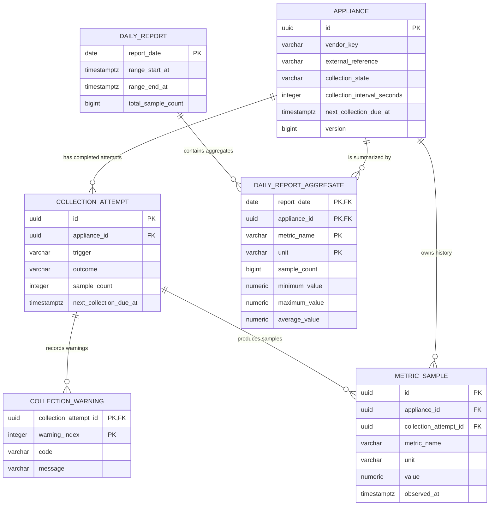

# Connected Appliance Platform — Data Model

## 1. Status and scope

Approved requirements and design decisions already establish PostgreSQL persistence, UTC timestamps, modular-monolith ownership, durable scheduling state, normalized metric history, completed collection attempts, immutable daily reports, non-persistent custom reports, and no physical appliance deletion.

The tables, column types, constraints, indexes, concurrency controls, numeric precision and warning-storage approach in this document are approved data-model decisions. They do not change any approved API contract or architecture decision.

The model contains six tables:

- `appliance`
- `collection_attempt`
- `collection_warning`
- `metric_sample`
- `daily_report`
- `daily_report_aggregate`

No table is introduced for custom reports, users, authentication, jobs, locks, raw vendor payloads, vendor-specific attributes, messaging, or unrelated auditing.

## 2. Modeling principles

- Use lowercase singular `snake_case` table and column names.
- Generate UUIDs in the application before persistence; do not require PostgreSQL extensions.
- Use `timestamptz` for instants and `date` for UTC report dates.
- Supply timestamps from the application’s injected UTC `Clock`; do not use database timestamp defaults.
- Configure the PostgreSQL session timezone as UTC for deterministic display, although `timestamptz` stores instants independently of session timezone.
- Use normalized relational rows rather than JSONB where fields have stable structure.
- Keep appliance identity and scheduling state in the Appliance module; attempts, warnings, and samples in Metrics; daily snapshots in Reporting.
- Enforce structural invariants in PostgreSQL and workflow rules in application services.
- Use `ON DELETE RESTRICT` for historical relationships.
- Use no database triggers.

## 3. Entity-relationship overview

## 4. Table definitions

### 4.1 `appliance`

**Owning module:** Appliance  
**Purpose:** Registered appliance identity, common metadata, lifecycle state, scheduling state, and latest collection summary.

| Column | PostgreSQL type | Null | Default | Mutability |
|---|---|---:|---|---|
| `id` | `uuid` | No | None; application-generated | Immutable |
| `display_name` | `varchar(100)` | No | None | Updateable |
| `description` | `varchar(500)` | Yes | `NULL` | Updateable |
| `vendor_key` | `varchar(50)` | No | None | Immutable |
| `external_reference` | `varchar(128)` | No | None | Immutable |
| `collection_state` | `varchar(16)` | No | `ACTIVE` | Updateable |
| `collection_interval_seconds` | `integer` | No | None | Updateable |
| `next_collection_due_at` | `timestamptz` | Conditional | None | Updateable |
| `consecutive_failure_count` | `integer` | No | `0` | Collection finalization only |
| `last_collection_status` | `varchar(20)` | No | `NEVER_ATTEMPTED` | Collection finalization only |
| `version` | `bigint` | No | `0` | Internal concurrency field |
| `created_at` | `timestamptz` | No | None | Immutable |
| `updated_at` | `timestamptz` | No | None | Updated only on real changes |

**Keys and constraints**

- Primary key: `id`.
- Unique constraint: `(vendor_key, external_reference)`.
- External-reference comparison remains case-sensitive; no lowercasing or case-insensitive index is applied.
- `vendor_key` must match the API’s lowercase-letter, digit, and hyphen format.
- `display_name` must remain non-blank.
- `external_reference` must remain non-blank but is otherwise stored unchanged as an opaque value.
- `collection_interval_seconds` must be between `5` and `86400`.
- `collection_state` must be `ACTIVE` or `PAUSED`.
- `last_collection_status` must be `NEVER_ATTEMPTED`, `SUCCESS`, `PARTIAL_SUCCESS`, or `FAILED`.
- `consecutive_failure_count >= 0`.
- `version >= 0`.
- `updated_at >= created_at`.
- Due-state invariant:
  - `PAUSED` requires `next_collection_due_at IS NULL`.
  - `ACTIVE` requires `next_collection_due_at IS NOT NULL`.

**Indexes**

- `(created_at ASC, id ASC)` for unfiltered appliance listing.
- `(collection_state, created_at ASC, id ASC)` for state-filtered listing.
- Partial index `(next_collection_due_at ASC, id ASC) WHERE collection_state = 'ACTIVE'` for scheduler due scans.
- The unique vendor/reference constraint supplies its own index.

**Lifecycle**

- Registration inserts an active appliance with due time equal to registration time plus the configured interval.
- Metadata, state, interval, latest status, failure count, due time, version, and `updated_at` are the only updateable values.
- Repeating identical metadata, state, or interval values performs no update, leaving `version`, `updated_at`, and due time unchanged.
- No `deleted_at` field is needed because the approved API has no deletion lifecycle.
- No application delete operation or repository delete method should exist.

### 4.2 `collection_attempt`

**Owning module:** Metrics  
**Purpose:** Immutable record of a completed manual or scheduled vendor invocation and its final scheduling result.

| Column | PostgreSQL type | Null | Default | Mutability |
|---|---|---:|---|---|
| `id` | `uuid` | No | None; application-generated | Immutable |
| `appliance_id` | `uuid` | No | None | Immutable |
| `trigger` | `varchar(16)` | No | None | Immutable |
| `outcome` | `varchar(20)` | No | None | Immutable |
| `started_at` | `timestamptz` | No | None | Immutable |
| `completed_at` | `timestamptz` | No | None | Immutable |
| `sample_count` | `integer` | No | None | Immutable |
| `failure_category` | `varchar(20)` | Yes | `NULL` | Immutable |
| `failure_message` | `varchar(500)` | Yes | `NULL` | Immutable |
| `retry_after_seconds` | `integer` | Yes | `NULL` | Immutable |
| `next_collection_due_at` | `timestamptz` | Yes | `NULL` | Immutable snapshot |

**Keys and constraints**

- Primary key: `id`.
- Foreign key: `appliance_id -> appliance.id ON DELETE RESTRICT`.
- Additional unique constraint `(id, appliance_id)` supports the metric-sample composite foreign key.
- `trigger` must be `MANUAL` or `SCHEDULED`.
- `outcome` must be `SUCCESS`, `PARTIAL_SUCCESS`, or `FAILED`.
- `completed_at >= started_at`.
- `sample_count >= 0`.
- `SUCCESS` and `PARTIAL_SUCCESS` require `sample_count > 0`.
- `FAILED` requires `sample_count = 0`.
- `SUCCESS` and `PARTIAL_SUCCESS` require all failure fields to be null.
- `FAILED` requires `failure_category`; its sanitized message remains optional.
- `failure_category` must be `TIMEOUT`, `RATE_LIMITED`, `INVALID_DATA`, `TRANSIENT`, or `UNEXPECTED`.
- `retry_after_seconds`, when present, must be positive and is permitted only for `RATE_LIMITED`.
- A non-null `next_collection_due_at` must not precede `completed_at`.

Warnings cannot be cross-validated with outcome using a simple row check. The application service must enforce:

- `SUCCESS`: no warnings and no failure.
- `PARTIAL_SUCCESS`: one or more warnings, valid samples, and no failure.
- `FAILED`: no samples, a failure category, and optional warnings explaining rejected readings.

**Indexes**

- `(appliance_id, started_at DESC, id ASC)` for unfiltered history.
- `(appliance_id, trigger, started_at DESC, id ASC)` for trigger filtering.
- `(appliance_id, outcome, started_at DESC, id ASC)` for outcome filtering.
- When both filters are supplied, PostgreSQL may use one selective index and filter the other condition; a fourth combined index is unnecessary for this scope.

**Lifecycle**

- Inserted only after vendor I/O completes.
- Never inserted for paused, busy, or process-interrupted calls that never reach finalization.
- All fields are immutable.
- `next_collection_due_at` is the value calculated for that attempt. It never follows later appliance changes.
- A null attempt due time records that the appliance was paused when finalization occurred.

### 4.3 `collection_warning`

**Owning module:** Metrics  
**Purpose:** Ordered, sanitized warnings associated with partial or failed collection attempts.

| Column | PostgreSQL type | Null | Default | Mutability |
|---|---|---:|---|---|
| `collection_attempt_id` | `uuid` | No | None | Immutable |
| `warning_index` | `integer` | No | None | Immutable |
| `code` | `varchar(64)` | No | None | Immutable |
| `message` | `varchar(500)` | No | None | Immutable |

**Keys and constraints**

- Composite primary key: `(collection_attempt_id, warning_index)`.
- Foreign key: `collection_attempt_id -> collection_attempt.id ON DELETE RESTRICT`.
- `warning_index >= 0`.
- `code` must use stable upper-snake-case machine-readable formatting.
- `message` must be non-blank and sanitized.
- The primary key supports retrieval in warning order; no additional index is needed.

**Storage decision**

A child table is recommended over JSONB because the warning structure is stable, ordering matters, field lengths can be constrained, and referential integrity remains explicit. JSONB would save one join but weaken shape validation and make malformed warning data easier to persist.

### 4.4 `metric_sample`

**Owning module:** Metrics  
**Purpose:** Append-only normalized numeric readings used for history and all reports.

| Column | PostgreSQL type | Null | Default | Mutability |
|---|---|---:|---|---|
| `id` | `uuid` | No | None; application-generated | Immutable |
| `appliance_id` | `uuid` | No | None | Immutable |
| `collection_attempt_id` | `uuid` | No | None | Immutable |
| `metric_name` | `varchar(64)` | No | None | Immutable |
| `unit` | `varchar(32)` | No | None | Immutable |
| `value` | `numeric(20,6)` | No | None | Immutable |
| `observed_at` | `timestamptz` | No | None | Immutable |
| `ingested_at` | `timestamptz` | No | None | Immutable |

`numeric(20,6)` provides 14 integer digits and six fractional digits, sufficient for the initial gauge use cases while mapping directly to `BigDecimal`.

**Keys and constraints**

- Primary key: `id`.
- Foreign key: `appliance_id -> appliance.id ON DELETE RESTRICT`.
- Composite foreign key:
  `(collection_attempt_id, appliance_id) -> collection_attempt(id, appliance_id) ON DELETE RESTRICT`.
- The composite foreign key prevents a sample from naming an appliance different from its attempt.
- Metric names and units must use upper-snake-case canonical formatting.
- Values must be finite; PostgreSQL special numeric values such as `NaN` must be rejected.
- Negative values are allowed because canonical metrics such as temperature may legitimately be negative.
- Exact valid metric/unit pairings are enforced by the application’s canonical catalog.
- No generic non-negative constraint is applied.

**Indexes**

- `(appliance_id, observed_at ASC, id ASC)` for paginated appliance history over `[from, to)`.
- `(observed_at ASC, appliance_id, metric_name, unit) INCLUDE (value)` for custom and daily range aggregation.

**Lifecycle**

- Samples are inserted in the same transaction as their completed attempt.
- They are never updated or replaced.
- Reports query only this table and never vendor-native data.
- No database duplicate constraint is recommended. Without a stable vendor reading identifier, `(attempt, metric, timestamp)` could reject legitimate same-time readings. UUID identity and application normalization are sufficient for v1.
- The application must ensure `collection_attempt.sample_count` equals the number of samples inserted for that attempt.

### 4.5 `daily_report`

**Owning module:** Reporting  
**Purpose:** Immutable header for one persisted UTC calendar-day snapshot.

| Column | PostgreSQL type | Null | Default | Mutability |
|---|---|---:|---|---|
| `report_date` | `date` | No | None | Immutable |
| `range_start_at` | `timestamptz` | No | None | Immutable |
| `range_end_at` | `timestamptz` | No | None | Immutable |
| `generated_at` | `timestamptz` | No | None | Immutable |
| `total_sample_count` | `bigint` | No | None | Immutable |

**Keys and constraints**

- Primary key: `report_date`.
- No UUID is added: the UTC date is already the approved public identifier and natural uniqueness boundary.
- `range_start_at` must equal UTC midnight at `report_date`.
- `range_end_at` must equal UTC midnight at `report_date + 1 day`.
- `range_start_at < range_end_at`.
- `generated_at >= range_end_at`, ensuring only completed UTC dates are persisted.
- `total_sample_count >= 0`.
- The primary key enforces exactly one report per UTC date and supports retrieval.
- The primary-key index can be scanned backward for date-descending listings; no extra listing index is needed.

**Lifecycle**

- Inserted once, together with all aggregate rows, in one transaction.
- An empty day creates a header with `total_sample_count = 0` and no aggregate rows.
- Never updated or regenerated.
- Late samples do not rewrite an existing daily report.

### 4.6 `daily_report_aggregate`

**Owning module:** Reporting  
**Purpose:** Immutable aggregate row grouped by daily report, appliance, canonical metric, and canonical unit.

| Column | PostgreSQL type | Null | Default | Mutability |
|---|---|---:|---|---|
| `report_date` | `date` | No | None | Immutable |
| `appliance_id` | `uuid` | No | None | Immutable |
| `metric_name` | `varchar(64)` | No | None | Immutable |
| `unit` | `varchar(32)` | No | None | Immutable |
| `sample_count` | `bigint` | No | None | Immutable |
| `minimum_value` | `numeric(20,6)` | No | None | Immutable |
| `maximum_value` | `numeric(20,6)` | No | None | Immutable |
| `average_value` | `numeric(20,6)` | No | None | Immutable |

**Keys and constraints**

- Composite primary key: `(report_date, appliance_id, metric_name, unit)`.
- Foreign key: `report_date -> daily_report.report_date ON DELETE RESTRICT`.
- Foreign key: `appliance_id -> appliance.id ON DELETE RESTRICT`.
- `sample_count > 0`.
- Numeric values must be finite.
- `minimum_value <= average_value <= maximum_value`.
- Metric-name and unit formatting follows `metric_sample`.
- The primary key supports retrieving all aggregates for one date without another index.

**Aggregation rules**

- `minimum_value` and `maximum_value` preserve the six-decimal sample scale.
- PostgreSQL calculates `AVG(numeric)` without floating-point conversion.
- Average is rounded once to six decimal places using `HALF_UP` when forming the public/persisted result.
- `daily_report.total_sample_count` equals the sum of child `sample_count` values.
- `aggregationCount` is derived with `COUNT(daily_report_aggregate)` in the daily-summary query rather than stored redundantly.
- Empty reports derive `aggregationCount = 0`.

## 5. Constraints and invariants

PostgreSQL constraints enforce:

- Unique case-sensitive vendor/reference registration.
- Valid interval bounds.
- Valid operational enum values.
- Active/due and paused/no-due consistency.
- Non-negative counters.
- Attempt timing and outcome/failure-field consistency.
- Same-appliance attempt/sample relationships.
- Finite numeric samples and aggregates.
- Exact daily UTC boundaries.
- One report per UTC date.
- One aggregate per report/appliance/metric/unit group.
- Referential integrity for all historical rows.

Application services enforce rules that would require cross-table checks, external knowledge, or triggers:

- Vendor key resolves to an adapter.
- Canonical metric/unit pairing.
- Warning/outcome consistency.
- Attempt `sample_count` equals inserted sample rows.
- Daily total equals aggregate-row counts.
- Aggregate arithmetic is correct.
- Current/future dates cannot be generated.
- Due-time and backoff calculations.
- Sanitization of failure and warning text.
- No-op state, interval, and metadata behavior.
- No physical deletion.

Focused PostgreSQL integration tests should verify constraint rejection, same-appliance composite foreign keys, due-state invariants, daily uniqueness, empty daily reports, and index-backed ordering.

## 6. Enum and value representation

Use `varchar` columns with named check constraints.

| Representation | Assessment |
|---|---|
| PostgreSQL native enums | Strong but require enum-specific migrations for additions and add avoidable Hibernate/JDBC mapping complexity. |
| `varchar` with checks | Readable in SQL, straightforward with JPA, validates stored data, and evolves through normal Flyway migrations. Recommended. |
| Java-only unconstrained `varchar` | Easy to extend but permits invalid values through scripts, tests, or mapping defects. Rejected. |

Operational allow lists:

- `collection_state`: `ACTIVE`, `PAUSED`
- `last_collection_status`: `NEVER_ATTEMPTED`, `SUCCESS`, `PARTIAL_SUCCESS`, `FAILED`
- `trigger`: `MANUAL`, `SCHEDULED`
- `outcome`: `SUCCESS`, `PARTIAL_SUCCESS`, `FAILED`
- `failure_category`: `TIMEOUT`, `RATE_LIMITED`, `INVALID_DATA`, `TRANSIENT`, `UNEXPECTED`

Canonical metric names and units also use constrained `varchar`, with database checks for stable upper-snake-case syntax and the application canonical catalog enforcing exact name/unit combinations. This avoids a migration for every compatible catalog addition while still preventing arbitrary vendor-native text.

## 7. Transaction and concurrency strategy

### Appliance registration

- Validate the vendor key through the adapter registry.
- Begin a short transaction.
- Generate UUID and UTC timestamps in the application.
- Insert the appliance as `ACTIVE`, with due time equal to creation time plus interval.
- Let the unique constraint arbitrate concurrent duplicate registrations and translate the constraint violation to `409 DUPLICATE_APPLIANCE`.

### Metadata update

- Begin a short transaction and load the appliance.
- Compare normalized values before mutating.
- Return unchanged data without issuing an update when identical.
- Otherwise update metadata, `updated_at`, and `version`.

### Collection interval update

- Lock the appliance row using `SELECT ... FOR UPDATE`.
- If the interval is unchanged, perform no update.
- If changed while active, set due time to the update time plus the new interval.
- If paused, retain null due time.
- Increment `version` only for a real change.

### Pause or resume

- Lock the appliance row.
- Repeating the current state is a no-op.
- Pausing sets `PAUSED` and clears due time.
- Resuming sets `ACTIVE` and sets due time to the current application UTC instant.
- Update `updated_at` and `version` only for a real transition.

### Collection-attempt finalization

Vendor I/O occurs before this transaction.

After the call completes:

1. Begin one short transaction.
2. Re-read and lock the appliance row through the public Appliance command port.
3. Use its latest state and interval.
4. Derive the outcome, warnings, sample count, failure state, and next due time.
5. Insert the immutable attempt, including its finalization-time due snapshot.
6. Insert warning and valid metric rows.
7. Update appliance failure count, latest status, and current due time.
8. Commit atomically.

If the latest state is paused, both the appliance’s due time and the attempt snapshot remain null. Finalization never changes the state to active.

If a pause commits before finalization locks the row, finalization observes `PAUSED`. If finalization locks first, a concurrent pause waits and clears due time afterward. The pause therefore wins in final state in either ordering.

The same ordering protects interval changes: finalization uses an interval committed before its lock; an interval update committed afterward recalculates due time using the newer interval.

`version` is recommended as defense against accidental stale entity updates, but it is internal and does not introduce ETags. Row locking is the primary coordination mechanism for short appliance mutation transactions.

A partial success is treated as a non-failed collection: it resets consecutive failures and uses the normal interval. A failed attempt increments the counter and applies the approved backoff policy.

### Daily-report creation

- Use PostgreSQL `READ COMMITTED`.
- Return an existing report immediately when found.
- Otherwise aggregate normalized samples and calculate immutable rows.
- Insert the report header with conflict handling on `report_date`.
- The transaction that inserts the header also inserts all aggregate rows.
- If another transaction wins the date conflict, discard the local result and return the winner’s stored representation.
- If the winner rolls back, the competing insert can proceed.
- No incomplete header is visible because header and aggregates commit together.

Custom reports execute one read-only aggregation query and persist nothing.

## 8. Query-to-index mapping

| Repository query | Predicate/order | Supporting index |
|---|---|---|
| List appliances | `ORDER BY created_at ASC, id ASC` | `appliance(created_at, id)` |
| List appliances by state | `WHERE collection_state = ? ORDER BY created_at, id` | `appliance(collection_state, created_at, id)` |
| Find due appliances | `collection_state = 'ACTIVE' AND next_collection_due_at <= ?` | Partial `appliance(next_collection_due_at, id)` |
| Attempt history | `appliance_id = ? ORDER BY started_at DESC, id ASC` | `collection_attempt(appliance_id, started_at DESC, id)` |
| Attempts by trigger | Adds `trigger = ?` | `collection_attempt(appliance_id, trigger, started_at DESC, id)` |
| Attempts by outcome | Adds `outcome = ?` | `collection_attempt(appliance_id, outcome, started_at DESC, id)` |
| Appliance metric history | `appliance_id = ? AND observed_at >= ? AND observed_at < ? ORDER BY observed_at, id` | `metric_sample(appliance_id, observed_at, id)` |
| Custom/daily aggregation | `observed_at >= ? AND observed_at < ? GROUP BY appliance_id, metric_name, unit` | `metric_sample(observed_at, appliance_id, metric_name, unit) INCLUDE (value)` |
| List daily reports | `ORDER BY report_date DESC` | Backward scan of `daily_report` primary key |
| Retrieve daily report | `report_date = ?` | `daily_report` primary key |
| Retrieve report aggregates | `report_date = ?` | `daily_report_aggregate` composite primary key |

No index is added for warning codes, failure categories across appliances, retention deletion, or other unapproved queries.

## 9. Daily-report idempotency

- `report_date` is the primary key and public natural identifier.
- An internal UUID would duplicate identity without improving the approved API.
- Concurrent generators may perform duplicate aggregation work, but only one can persist the date.
- Header and aggregate rows are committed atomically.
- Repeated generation returns the exact stored `generated_at`, totals, and aggregates.
- Empty daily reports participate in the same idempotency rule.
- Late-arriving samples remain available in history and custom reports but do not mutate an existing daily snapshot.
- `aggregationCount` is computed from child rows, avoiding a redundant counter that could drift.

## 10. Data lifecycle and deletion rules

- No public or application-level physical appliance deletion exists.
- Appliances, attempts, warnings, samples, daily reports, and daily aggregates have no automatic retention deletion.
- All historical foreign keys use `ON DELETE RESTRICT`.
- No orphan attempt, warning, sample, or report aggregate can be created.
- Attempts, warnings, samples, and reports are append-only or immutable by domain design.
- Separate database roles or delete-denying triggers are not justified for the local take-home scope.
- A privileged manual database operator could still delete an unreferenced appliance; preventing that is an operational-permissions concern, not a public workflow.
- Future retention would require an explicitly approved policy and ordered archival/deletion design.

## 11. High-level Flyway migration sequence

1. **Foundational appliance schema**
   - Create `appliance`.
   - Add identity, lifecycle, interval, due-state, enum, optimistic-version, uniqueness, and listing/due indexes.

2. **Metric-collection schema**
   - Create `collection_attempt`.
   - Create `collection_warning`.
   - Create `metric_sample`.
   - Add composite attempt/appliance integrity and attempt/history/aggregation indexes.

3. **Reporting schema**
   - Create `daily_report`.
   - Create `daily_report_aggregate`.
   - Add UTC-boundary, count, aggregate, uniqueness, and foreign-key constraints.

No SQL or migration files are generated at this stage.

## 12. Decisions and trade-offs

| Decision | Recommendation | Alternatives | Trade-off |
|---|---|---|---|
| UUID generation | Application-generated UUID | PostgreSQL `gen_random_uuid()` | No extension dependency; callers must always assign IDs. |
| Warning storage | Child rows | JSONB on attempt | Stronger shape and ordering; requires a join. |
| Appliance concurrency | Row locks plus internal version | Optimistic retry only | Very clear for one instance; serializes short mutations per appliance. |
| Enum persistence | `varchar` with checks | PostgreSQL enums; Java-only validation | Easy JPA/Flyway evolution with strong structural integrity. |
| Metric precision | `numeric(20,6)` | `double precision`; unconstrained numeric | Deterministic reporting; fixed six-decimal ceiling. |
| Negative samples | Allowed | Global non-negative check | Supports legitimate canonical values; metric-specific limits remain in the catalog. |
| Duplicate samples | No inferred unique key | Unique attempt/name/time tuple | Avoids rejecting legitimate readings; adapters must normalize responsibly. |
| Daily identity | UTC `date` primary key | Internal UUID plus unique date | Matches the API and simplifies idempotency; less uniform than UUID entities. |
| Daily aggregate storage | Relational child rows | JSONB snapshot | Queryable and constrained; more rows and mappings. |
| `aggregationCount` | Derived from child rows | Stored counter | Cannot drift; listing query performs a grouped count. |
| Immutability | Domain/repository design plus constraints | Update-denying triggers | Reviewer-friendly and testable; privileged SQL can still mutate data. |

## 13. Approved data-model assumptions

These are approved data-model decisions for the current solution. They are not original assignment requirements or previously approved architecture or API decisions.

- UUIDs are generated by the application.
- All persisted numeric readings use `numeric(20,6)`.
- Report averages use six decimal places and `HALF_UP`.
- Warning codes use at most 64 characters.
- Sanitized warning and failure messages use at most 500 characters.
- Warning ordering is zero-based.
- A partial success resets consecutive failures and uses the normal interval.
- Appliance mutations use short row-locking transactions.
- An internal `bigint` optimistic version is retained but is not public.
- Canonical metric and unit strings use upper-snake-case persistence formatting.
- Duplicate metric readings have no inferred database uniqueness rule.
- No database timestamp defaults or triggers are used.

## 14. Open decisions

The following remain intentionally unresolved and do not alter the table topology:

- Exact canonical metric-name catalog.
- Exact canonical unit catalog and allowed name/unit pairings.
- Final collection-warning code catalog.
- Future historical metric and daily-report retention periods.
- Exact backoff values, vendor timeouts, scheduler tick, and executor settings; these are configuration/application decisions rather than schema decisions.
- Whether optional prior-day fixture data will be supplied for non-empty daily Swagger verification.
