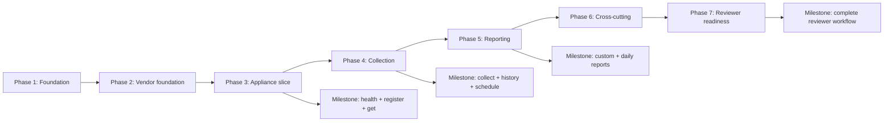

# Connected Appliance Platform — Implementation Plan

## 1. Status and purpose

The requirements, modular-monolith architecture, public REST API, PostgreSQL data model, module ownership, and transaction/concurrency rules are approved.

This plan translates them into 32 ordered, reviewable implementation tasks. The version pins, package name, canonical metric catalog, mock behavior, operational defaults, fixture policy, and documentation structure in Section 3 are approved implementation decisions.

No public endpoint, DTO, validation bound, table, constraint, index, or approved business rule is changed.

## 2. Implementation principles

- Deliver health, registration, and retrieval as the first vertical slice.
- Add tests in the same commit as each behavior.
- Keep `mvn test` Docker-free and fast; reserve PostgreSQL/Testcontainers suites for `mvn verify`.
- Use feature-first packages with internal entities and persistence adapters.
- Use Java records for public DTOs where suitable; do not add Lombok or mapping libraries.
- Keep controllers dependent only on application services.
- Keep vendor calls outside transactions; finalize collection in one short transaction.
- Use controlled `Clock`, latches, fakes, and direct coordinator calls instead of sleeping in tests.
- Use Spring Boot dependency management and avoid unnecessary libraries.
- Use plain JUnit/JDK source-boundary checks instead of adding ArchUnit.
- Keep every task suitable for one focused Codex prompt and one focused commit.

## 3. Approved implementation decisions

These values are approved for the current implementation.

| Decision | Approved value | Reason |
|---|---|---|
| Maven coordinates | `com.example.connectedappliance:connected-appliance-platform` | Neutral and not Cisco-specific |
| Java package root | `com.example.connectedappliance` | Short, neutral, and feature-package friendly |
| Java | 17 | Approved baseline |
| Spring Boot | `3.5.16` | Spring Boot 3.5.16 is the last OSS release of the 3.5.x generation. Boot 4 is intentionally excluded because the approved technology baseline is Spring Boot 3. ([official release](https://spring.io/blog/2026/06/25/spring-boot-3-5-16-available-now/)) |
| Maven distribution | `3.9.16` | Current Maven 3 release ([official download page](https://maven.apache.org/download.cgi)) |
| Maven Wrapper | `3.3.4` | Pins the wrapper implementation independently of the Maven distribution |
| Springdoc | `2.8.17` | Current 2.x release compatible with Boot 3.5 ([compatibility matrix](https://springdoc.org/faq.html)) |
| Testcontainers | Version managed by Spring Boot; no explicit version override | Keeps the testing dependencies aligned with Spring Boot dependency management |
| PostgreSQL | `postgres:17.10-alpine3.24` | Fully pinned PostgreSQL and Alpine versions for repeatable local and integration-test execution ([version policy](https://www.postgresql.org/support/versioning/)) |
| Canonical metrics | `TEMPERATURE`, `POWER` | Matches approved API examples and demonstrates normalization |
| Canonical units | `TEMPERATURE/CELSIUS`, `POWER/WATT` | One canonical unit per metric |
| Mock Alpha input | `temp_c` in Celsius; `power_w` in watts | Direct-name/direct-unit mapping |
| Mock Alpha values | `21.500000 CELSIUS`, `125.000000 WATT` | Stable reviewer-friendly values |
| Mock Beta input | `temperature_f` in Fahrenheit; `power_kw` in kilowatts | Demonstrates name and unit conversion |
| Mock Beta values | `71.600000°F → 22.000000°C`; `0.150000 kW → 150.000000 W` | Deterministic exact outcomes |
| Decimal conversion | Six decimal places, `HALF_UP` | Matches approved persistence precision |
| Warning codes | `UNKNOWN_METRIC`, `MALFORMED_VALUE`, `INCOMPATIBLE_UNIT` | Covers approved normalization warnings |
| Mock fault control | Per-vendor configuration mode: `SUCCESS`, `PARTIAL`, `TIMEOUT`, `RATE_LIMITED`, `INVALID_DATA`, `TRANSIENT`, `UNEXPECTED` | No vendor-specific appliance fields or public test APIs |
| Default mock mode | `SUCCESS`, zero artificial delay | Fast local verification |
| Scheduler tick | 5 seconds; due batch limit 100 | Matches minimum collection interval and local scale |
| Vendor timeout | 2 seconds | Keeps synchronous collect-now reviewable |
| Collection executor | Fixed size 4; queue capacity 16 | Bounded without production-scale tuning |
| Executor saturation | Rejection before vendor invocation releases the appliance guard, creates no attempt, and leaves appliance failure/due state unchanged. Manual collection returns sanitized `503 SERVICE_UNAVAILABLE`; scheduled collection logs the outcome and leaves the appliance due. | Makes overload explicit without converting local executor pressure into a vendor or appliance failure |
| Backoff | `min(interval × 2^consecutiveFailures, 86400s)` | Simple capped exponential backoff |
| Rate-limit delay | `max(calculatedBackoff, retryAfterSeconds)` | Never retries before vendor guidance |
| Partial success | Reset failures; schedule normal interval | Already approved by the data model |
| Daily generation | `00:10 UTC` for the previous UTC date | Deterministic and allows a small post-midnight margin |
| Local database | DB/user `connected_appliance`; password `connected_appliance_local`; port 5432 | Explicitly safe local-only defaults |
| Runtime profiles | Common defaults plus `local`, `test`, and opt-in `review-fixtures` | Separates reviewer, automated-test, and fixture behavior |
| Prior-day fixture | Provide opt-in `review-fixtures`; disabled by default | Enables non-empty daily Swagger verification without mandatory seed data |
| Documentation | One README with linked authoritative docs and an `AI usage` section; no separate AI file | Keeps reviewer navigation simple |
| Integration-test naming | `*IT` executed by Maven Failsafe | Clean `test` versus `verify` separation |

The Maven Wrapper `distributionUrl` downloads Maven `3.9.16`; Maven Wrapper `3.3.4` is the wrapper implementation used to bootstrap that distribution.

Configuration keys should use validated `@ConfigurationProperties`, including:

- `app.collection.scheduler-tick`
- `app.collection.due-batch-size`
- `app.collection.vendor-timeout`
- `app.collection.executor-size`
- `app.collection.executor-queue-capacity`
- `app.collection.backoff-cap`
- `app.collection.scheduling-enabled`
- `app.reporting.daily-cron`
- `app.reporting.scheduling-enabled`
- `app.mock-vendors.<vendor-key>.scenario`
- `app.mock-vendors.<vendor-key>.delay`

## 4. Phase overview

| Phase | Tasks | Outcome |
|---|---:|---|
| 1. Foundation | 1–5 | Reproducible build, PostgreSQL, health, test harness, errors, correlation |
| 2. Vendor foundation | 6–7 | Stable canonical contracts and one supported mock adapter |
| 3. Appliance slice | 8–13 | Register/get/list/manage appliances with concurrency rules |
| 4. Collection | 14–21 | Two vendors, collect-now, attempts, samples, history, scheduler |
| 5. Reporting | 22–27 | Shared aggregation, custom reports, daily persistence and scheduling |
| 6. Cross-cutting | 28–29 | Logs, metrics, Swagger, contract and module-boundary verification |
| 7. Reviewer readiness | 30–32 | Optional fixtures, full E2E path, README, traceability, clean repository |

This order front-loads build, database, error, and adapter contracts before feature code. It avoids temporarily bypassing supported-vendor validation and makes the first usable API slice available before collection and reporting complexity.

## 5. Detailed task sequence

### Phase 1 — Foundation

### Task 1 — Bootstrap the Maven/Spring Boot application

- **Objective:** Create a minimal, database-independent Java 17 Spring Boot application and reproducible Maven build.
- **Dependencies:** None.
- **Approved behavior:** One locally runnable Maven/Spring Boot modular monolith.
- **Expected areas:** `pom.xml`, Maven Wrapper `3.3.4` configured to download Maven `3.9.16`, main application class, `.gitignore`, and basic smoke test.
- **Boundaries:** Add only the minimal Spring Boot web, validation, Actuator, and test foundation required for a database-free context smoke test. Do not add Spring Data JPA, Flyway, the PostgreSQL JDBC driver, H2, another embedded database, feature behavior, Lombok, security, messaging, or cloud dependencies.
- **Tests:** Database-free JUnit application-context smoke test.
- **Validation:** `./mvnw -q test`.
- **Completion:** The wrapper builds from a clean checkout and the application context starts without a datasource, database configuration, or database-dependent feature.
- **Commit:** `build: bootstrap Spring Boot Maven application`
- **AI review risks:** Extra starters, wrong Java release, incorrect wrapper/distribution versions, premature database dependencies, embedded-database fallback, unmanaged dependency versions, generated IDE/build files.

### Task 2 — Establish feature packages, configuration binding, and UTC Clock

- **Objective:** Create module package skeletons and shared configuration conventions.
- **Dependencies:** Task 1.
- **Approved behavior:** Feature-first modular monolith; injected UTC `Clock`; clear module ownership.
- **Expected areas:** `bootstrap`, `shared`, `appliance`, `metrics`, `vendor`, and `reporting`, each with applicable `api/application/domain/infrastructure` areas.
- **Boundaries:** Cross-module contracts live in public application-port packages; entities and repositories remain internal.
- **Tests:** Pure unit test for UTC `Clock`; initial JUnit/JDK source-boundary test.
- **Validation:** `./mvnw -q test`.
- **Completion:** Clock is injectable; validated configuration properties bind; package dependency rules are documented in package metadata and checked.
- **Commit:** `chore: establish modular packages and UTC configuration`
- **AI review risks:** Layer-first packages, public repositories, direct cross-module infrastructure imports, system-clock calls.

### Task 3 — Add PostgreSQL dependencies, local database, and health-only Actuator configuration

- **Objective:** Add the approved persistence dependencies and make local PostgreSQL startup and health verification work before business features.
- **Dependencies:** Tasks 1–2.
- **Approved behavior:** PostgreSQL local execution; Actuator health only; safe local defaults.
- **Expected areas:** `pom.xml` additions for Spring Data JPA, Flyway, and the PostgreSQL JDBC driver; `compose.yaml`; common/local YAML configuration; datasource and Actuator settings.
- **Boundaries:** Use `postgres:17.10-alpine3.24`. Do not add H2 or another embedded database. Expose only `health`; hide credentials and detailed database information; set `ddl-auto=validate` and `open-in-view=false`.
- **Database-independent smoke test:** Update the original Task 1 smoke test so it remains database-independent after persistence dependencies are added. It must either exclude database auto-configuration or become an appropriately focused context test. Full application startup with Flyway, JPA, and PostgreSQL is verified by `DatabaseSmokeIT` under Maven `verify`.
- **Tests:** Configuration-binding test; MVC/HTTP health behavior test with mocked health state.
- **Validation:** `docker compose config`; start PostgreSQL and run `curl -i localhost:8080/actuator/health`.
- **Completion:** With local PostgreSQL running, health reports application/database `UP`; no other Actuator web endpoint is exposed.
- **Commit:** `ops: add local PostgreSQL and health configuration`
- **AI review risks:** Committed real secrets, unpinned image tag, H2 fallback, unrestricted Actuator exposure, Hibernate schema creation, database dependencies added outside this task.

### Task 4 — Add shared Testcontainers PostgreSQL support and Maven integration-test lifecycle

- **Objective:** Make `mvn verify` provision an isolated PostgreSQL database automatically.
- **Dependencies:** Tasks 1–3.
- **Approved behavior:** Test-only Testcontainers PostgreSQL; no manual test database.
- **Expected areas:** Testcontainers dependencies managed by Spring Boot, Failsafe configuration, shared integration-test PostgreSQL support, and `DatabaseSmokeIT`.
- **Boundaries:** Use `postgres:17.10-alpine3.24`. `mvn test` must not require Docker; `*IT` runs only under Failsafe. One container may be shared among integration-test classes within one Maven `verify` JVM, but every new `mvn verify` execution starts a fresh PostgreSQL container. Do not enable Testcontainers reusable-container mode or call `withReuse(true)`. Integration tests isolate their data through transaction rollback, explicit cleanup, or unique test identifiers.
- **Tests:** Testcontainers connectivity and application-context integration test; isolation check demonstrating that test data does not leak between test cases.
- **Validation:** `./mvnw dependency:tree -Dincludes=org.testcontainers`; `./mvnw -q verify`.
- **Completion:** Spring Boot supplies the Testcontainers version without an explicit override; a fresh container starts for each `mvn verify` execution, its datasource is injected, classes may share it within that JVM, test data remains isolated, and cleanup occurs when the run ends.
- **Commit:** `test: add PostgreSQL Testcontainers integration harness`
- **AI review risks:** Explicit Testcontainers version overrides, `withReuse(true)`, reuse configuration, hard-coded ports, H2 fallback, Surefire accidentally running Docker tests, order-dependent shared test data.

### Task 5 — Implement sanitized ProblemDetail handling and correlation IDs

- **Objective:** Establish the API error and request-correlation contract before controllers proliferate.
- **Dependencies:** Tasks 1–4.
- **Approved behavior:** Exact `X-Correlation-ID` rules; sanitized ProblemDetail; `MALFORMED_JSON` versus `VALIDATION_ERROR`.
- **Expected areas:** `shared.error`, `shared.observability`, servlet filter, exception advice, validation-error mapper.
- **Boundaries:** Filter applies to business and health responses; invalid supplied IDs are never logged; MDC is cleared in `finally`.
- **Tests:** MVC tests for valid, missing, repeated, blank, malformed, and overlong IDs; malformed JSON; unknown fields; sanitized unexpected errors.
- **Validation:** `./mvnw -q test`.
- **Completion:** Every response echoes an effective ID; ProblemDetails match the approved shape and expose no internals.
- **Commit:** `feat: add sanitized API errors and correlation IDs`
- **AI review risks:** Treating malformed JSON as validation, leaking exception messages, accepting comma-joined headers, failing to clear MDC.

### Phase 2 — Vendor foundation

### Task 6 — Define canonical metrics and outbound vendor contracts

- **Objective:** Establish vendor-neutral metric and adapter types before appliance registration.
- **Dependencies:** Tasks 1–2.
- **Approved behavior:** Adapter abstraction, canonical normalization, supported-vendor validation.
- **Expected areas:** Metrics outbound port, Appliance supported-vendor port, shared canonical metric/unit value types.
- **Boundaries:** No vendor-native fields in Appliance; no persistence or controller dependency.
- **Tests:** Pure unit tests for allowed metric/unit pairs and `numeric(20,6)` scale policy.
- **Validation:** `./mvnw -q test`.
- **Completion:** Only `TEMPERATURE/CELSIUS` and `POWER/WATT` are accepted as initial canonical pairs.
- **Commit:** `feat: define canonical metric and vendor ports`
- **AI review risks:** Stringly typed metric pairs, vendor-specific common fields, floating-point values.

### Task 7 — Implement adapter registry and deterministic Mock Alpha

- **Objective:** Supply one real supported adapter for the early registration slice.
- **Dependencies:** Task 6.
- **Approved behavior:** Registry lookup by stable key; duplicate keys fail startup; deterministic mock.
- **Expected areas:** Vendor registry, Mock Alpha adapter, configuration properties.
- **Boundaries:** Vendor integration implements declared ports; collection output is canonical; no database access.
- **Tests:** Adapter contract tests; duplicate-key startup failure; supported/unsupported lookup tests.
- **Validation:** `./mvnw -q test`.
- **Completion:** `mock-alpha` is supported and deterministically returns approved canonical readings.
- **Commit:** `feat: add vendor registry and mock-alpha adapter`
- **AI review risks:** Controller conditionals, random values, native names escaping the adapter, silent duplicate keys.

### Phase 3 — Appliance slice

### Task 8 — Create the appliance Flyway migration

- **Objective:** Implement the approved `appliance` table, constraints, and indexes exactly.
- **Dependencies:** Task 4.
- **Approved behavior:** Approved columns, uniqueness, checks, due-state invariant, version, and query indexes.
- **Expected areas:** First Flyway migration and appliance-schema integration tests.
- **Boundaries:** No additional columns, enums, triggers, timestamp defaults, or deletion mechanism.
- **Tests:** PostgreSQL integration tests for uniqueness, interval bounds, enum checks, active/paused due invariant, and indexes.
- **Validation:** `./mvnw -q -Dit.test=ApplianceSchemaIT verify`.
- **Completion:** Migration applies from empty PostgreSQL and rejects invalid rows as documented.
- **Commit:** `db: create appliance schema`
- **AI review risks:** PostgreSQL enum types, case-insensitive external reference, missing partial due index, database-generated timestamps.

### Task 9 — Implement Appliance domain and persistence adapter

- **Objective:** Map the approved appliance aggregate and repository queries.
- **Dependencies:** Task 8.
- **Approved behavior:** App-generated UUIDs, immutable vendor identity, internal optimistic version, list/due queries.
- **Expected areas:** Appliance domain, internal JPA entity/repository, mapper, repository adapter.
- **Boundaries:** JPA entity and Spring Data repository are not public; no web DTO annotations in the domain.
- **Tests:** Pure domain tests and Testcontainers repository tests for registration persistence, ordering, state filter, and due query.
- **Validation:** `./mvnw -q test`; `./mvnw -q -Dit.test=ApplianceRepositoryIT verify`.
- **Completion:** Repository operations match approved ordering and constraints without exposing persistence types.
- **Commit:** `feat: implement appliance domain persistence`
- **AI review risks:** Entity equality based on mutable fields, exposing entity objects, using database time, updateable vendor identity.

### Task 10 — Implement appliance registration and retrieval APIs

- **Objective:** Deliver the first business vertical slice.
- **Dependencies:** Tasks 5, 7, and 9.
- **Approved behavior:** `POST /api/v1/appliances`, `GET /api/v1/appliances/{id}`, supported-vendor and duplicate behavior.
- **Expected areas:** Appliance application services, request/response DTOs, mapper, controller.
- **Boundaries:** Controller calls services only; registration validates through `SupportedVendorPort`.
- **Tests:** Domain tests, Mockito service tests, MVC validation/error tests, end-to-end Testcontainers register/get test.
- **Validation:** `./mvnw -q test`; `./mvnw -q -Dit.test=ApplianceRegistrationIT verify`.
- **Completion:** Reviewer can start PostgreSQL/app, check health, register `mock-alpha`, and retrieve it.
- **Commit:** `feat: add appliance registration and retrieval`
- **AI review risks:** Wrong status/Location header, repository injection in controller, unsupported vendor mapped to 400, entity serialization.

### Task 11 — Implement appliance listing

- **Objective:** Add paginated, optionally state-filtered appliance listing.
- **Dependencies:** Task 10.
- **Approved behavior:** Zero-based pagination, size bounds, fixed order, empty-page behavior.
- **Expected areas:** Appliance list query service, page DTO, controller operation.
- **Boundaries:** No arbitrary client sorting or new filters.
- **Tests:** Pure page-mapping tests, MVC pagination validation, repository ordering integration test.
- **Validation:** `./mvnw -q test`; focused repository IT under `mvn verify`.
- **Completion:** Listing matches the approved page contract and deterministic order.
- **Commit:** `feat: add appliance listing`
- **AI review risks:** One-based pages, unsorted queries, leaking Spring `Page`, accepting unsupported sort parameters.

### Task 12 — Implement display-metadata replacement

- **Objective:** Add idempotent display metadata updates.
- **Dependencies:** Task 10.
- **Approved behavior:** Metadata-only `PUT`; null/omitted description clears it; identical input is a no-op.
- **Expected areas:** Metadata command service, DTO, controller mapping.
- **Boundaries:** Vendor identity and collection state remain untouched.
- **Tests:** Unit no-op tests, Mockito service tests, MVC validation, integration test confirming unchanged version/timestamp on repetition.
- **Validation:** `./mvnw -q test`; focused appliance IT.
- **Completion:** Only actual changes update `updated_at` and version.
- **Commit:** `feat: add appliance metadata updates`
- **AI review risks:** PATCH semantics, changing immutable fields, updating timestamps on no-op.

### Task 13 — Implement interval and collection-state commands

- **Objective:** Complete appliance management and concurrency rules.
- **Dependencies:** Tasks 9–10.
- **Approved behavior:** Interval `PUT`; combined ACTIVE/PAUSED state `PUT`; row locks; immediate due on resume; null due on pause.
- **Expected areas:** Appliance command port/service, locking repository query, DTOs, controller operations.
- **Boundaries:** Repeating current state/interval performs no update; version remains internal.
- **Tests:** Unit transition tests, MVC bounds/enums, PostgreSQL locking tests using latches and controlled Clock.
- **Validation:** `./mvnw -q test`; `./mvnw -q -Dit.test=ApplianceConcurrencyIT verify`.
- **Completion:** State/due invariant always holds and concurrent changes do not overwrite one another.
- **Commit:** `feat: add appliance collection configuration commands`
- **AI review risks:** Resume scheduled after interval instead of immediately, stale detached entity updates, sleeps in concurrency tests.

### Phase 4 — Collection

### Task 14 — Add Mock Beta, conversions, and configurable fault scenarios

- **Objective:** Complete vendor variation and deterministic failure demonstrations.
- **Dependencies:** Tasks 6–7.
- **Approved behavior:** Two mock vendors, unit/name normalization, partial warnings, typed failures.
- **Expected areas:** Mock Beta adapter, converter utilities, scenario configuration, Mock Alpha scenario extensions.
- **Boundaries:** Default success; no fault controls in appliance fields or public endpoints.
- **Tests:** Adapter contract tests for conversion, rounding, partial data, invalid data, rate limit, transient, timeout, and unexpected failure.
- **Validation:** `./mvnw -q test`.
- **Completion:** Both adapters return identical canonical contracts from distinct native representations.
- **Commit:** `feat: add mock-beta and vendor fault scenarios`
- **AI review risks:** Binary floating point, random output, sleeping tests, raw exception/payload exposure.

### Task 15 — Create collection-attempt, warning, and metric migrations

- **Objective:** Implement the approved Metrics-owned tables and indexes.
- **Dependencies:** Tasks 4 and 8.
- **Approved behavior:** Completed immutable attempts, ordered warning rows, append-only normalized samples, same-appliance composite FK.
- **Expected areas:** Second Flyway migration and schema integration tests.
- **Boundaries:** No raw payload table, job table, claim state, or inferred duplicate constraint.
- **Tests:** PostgreSQL constraint tests for outcomes/failures, retry-after, warning index, numeric validity, composite FK, and index definitions.
- **Validation:** `./mvnw -q -Dit.test=MetricsSchemaIT verify`.
- **Completion:** Migration applies after V1 and enforces the documented integrity rules.
- **Commit:** `db: create metric collection schema`
- **AI review risks:** JSONB warnings, cascade deletion, missing composite FK, extra uniqueness on samples.

### Task 16 — Implement Metrics persistence adapters

- **Objective:** Persist and query attempts, warnings, and samples internally.
- **Dependencies:** Task 15.
- **Approved behavior:** Immutable entities; attempt snapshot due time; approved history ordering and filters.
- **Expected areas:** Metrics domain records, internal JPA entities/repositories, persistence mappers/adapters.
- **Boundaries:** Metrics repositories never access Appliance persistence; relationships use identifiers and ports.
- **Tests:** Repository Testcontainers tests for atomic inserts, warning order, attempt filters, metric range boundaries, and pagination.
- **Validation:** `./mvnw -q -Dit.test=MetricsRepositoryIT verify`.
- **Completion:** Repository queries match `[from,to)` and fixed API ordering.
- **Commit:** `feat: implement metric persistence adapters`
- **AI review risks:** Lazy-loading DTO serialization, mutable sample entities, querying vendors for history, wrong boundary inclusivity.

### Task 17 — Implement overlap guard, bounded vendor executor, classification, and backoff

- **Objective:** Build independently testable collection-control primitives, including deterministic saturation behavior.
- **Dependencies:** Tasks 6 and 14.
- **Approved behavior:** Per-appliance in-memory guard, bounded execution, timeout, typed failures, capped backoff. If the executor rejects work before vendor invocation, release the guard and return a distinct saturation outcome without invoking the vendor.
- **Expected areas:** Metrics application utilities, executor configuration, failure classifier, scheduling policy.
- **Boundaries:** No distributed/database locks, Spring Retry, circuit breaker, or vendor I/O transaction. Executor rejection must not create a collection attempt or initiate failure-count/next-due updates.
- **Tests:** Pure unit and Mockito tests using latches, a rejecting fake executor, and controlled Clock. Verify guard release, no vendor invocation, distinct saturation result, and successful subsequent guard acquisition without wall-clock sleeping.
- **Validation:** `./mvnw -q test`.
- **Completion:** Busy acquisition and executor saturation are deterministic; saturation never leaks the guard or mutates collection state; every vendor failure category produces the approved next-due calculation.
- **Commit:** `feat: add collection coordination and backoff`
- **AI review risks:** Guard leaks after rejected submission, unbounded executor, treating saturation as vendor failure, creating attempts before vendor invocation, integer overflow, retry loops, wall-clock tests.

### Task 18 — Implement shared collection orchestration and atomic finalization

- **Objective:** Add the single workflow used by manual and scheduled collection.
- **Dependencies:** Tasks 13–17.
- **Approved behavior:** Eligibility, adapter selection, normalization, persistence, latest-state finalization, failure-state updates, and explicit executor-saturation handling.
- **Expected areas:** Metrics collection application service and Appliance public query/command-port implementations.
- **Boundaries:** Vendor call before transaction; one short finalization transaction; no direct Appliance repository/entity access from Metrics. If executor submission is rejected, release the overlap guard, do not invoke the vendor or finalization path, persist no attempt, warning, or sample, leave consecutive failures and due state unchanged, and return a saturation result usable by manual and scheduled callers.
- **Tests:** Mockito orchestration tests and Testcontainers transaction/concurrency tests for success, partial, failed, pause-during-call, and interval-change-during-call. Add a rejecting-executor test proving guard release, no vendor/port persistence calls, unchanged appliance state, no attempt, and no wall-clock sleeping.
- **Validation:** `./mvnw -q test`; `./mvnw -q -Dit.test=CollectionFinalizationIT verify`.
- **Completion:** Attempt, warnings, samples, and Appliance state commit or roll back together; a concurrent pause is never reactivated; executor saturation performs no finalization and leaves the appliance eligible for a later scheduler tick.
- **Commit:** `feat: implement shared metric collection workflow`
- **AI review risks:** `@Transactional` around vendor I/O, stale state snapshots, cross-module repository access, partial persistence, persisting a failed attempt or applying backoff after executor rejection.

### Task 19 — Expose collect-now

- **Objective:** Add the reviewer-friendly synchronous manual trigger.
- **Dependencies:** Tasks 5 and 18.
- **Approved behavior:** Exact collect-now path; paused/busy 409; completed vendor outcomes returned as persisted 200 attempts. Executor rejection before vendor invocation returns sanitized `503 SERVICE_UNAVAILABLE`.
- **Expected areas:** Metrics API DTO mapper, collect-now application use case, controller.
- **Boundaries:** No request body, async job, alternate collection logic, or vendor exception details. A saturation response must not persist an attempt or modify consecutive failures or next due state.
- **Tests:** MVC tests for success, paused, busy, executor saturation, not-found, timeout, rate limit, partial, and unexpected failure; E2E success IT. Saturation tests use a rejecting executor and verify sanitized 503 behavior, guard release, no attempt, unchanged state, and no sleeping.
- **Validation:** `./mvnw -q test`; focused collect-now IT.
- **Completion:** A successful request produces an inspectable persisted attempt and samples; executor saturation returns sanitized 503 without vendor invocation or persistent side effects.
- **Commit:** `feat: expose collect-now workflow`
- **AI review risks:** Mapping vendor timeout to HTTP 504, mapping executor saturation to a vendor failure, creating attempts for precondition or saturation failures, duplicating scheduler logic.

### Task 20 — Expose attempt and normalized metric history

- **Objective:** Complete persisted collection observability through approved APIs.
- **Dependencies:** Tasks 16 and 19.
- **Approved behavior:** Attempt filters/pagination; normalized metric `[from,to)` history; empty success results.
- **Expected areas:** Metrics query services, response DTOs, controllers.
- **Boundaries:** Read persistence only; never call vendors; no additional filters.
- **Tests:** Query-service tests, MVC range/error/pagination tests, PostgreSQL ordering and empty-result tests.
- **Validation:** `./mvnw -q test`; focused history IT.
- **Completion:** Persisted collect-now output is retrievable through both approved history operations.
- **Commit:** `feat: expose collection and metric history`
- **AI review risks:** Missing range mapped incorrectly, non-UTC acceptance, returning attempt’s current appliance due instead of snapshot.

### Task 21 — Implement scheduled collection coordinator

- **Objective:** Collect active due appliances through the shared service.
- **Dependencies:** Tasks 17–20.
- **Approved behavior:** Database-backed due state, scheduler tick, in-memory overlap skip, one instance. Executor saturation is logged and leaves the appliance due for a later scheduler tick.
- **Expected areas:** Metrics scheduling coordinator and conditional scheduler configuration.
- **Boundaries:** Scheduler only selects due IDs and invokes shared collection; no claims or transaction around vendor calls. Saturation must not create an attempt, update failure state, or advance the due time.
- **Tests:** Coordinator tests with controlled Clock, mocked collection service, and saturation result; integration due-query test; verify saturation logging/outcome handling and later eligibility without sleeping.
- **Validation:** `./mvnw -q test`; scheduler-focused IT where appropriate.
- **Completion:** Due appliances are processed, busy or saturated appliances remain due, and restart eligibility is preserved.
- **Commit:** `feat: schedule due appliance collection`
- **AI review risks:** Advancing due before I/O, treating local saturation as a collection failure, database claim columns, overlapping logic duplicated in scheduler.

### Phase 5 — Reporting

### Task 22 — Implement the shared aggregation query

- **Objective:** Aggregate normalized samples by appliance, metric, and unit.
- **Dependencies:** Tasks 16 and 20.
- **Approved behavior:** Count/min/max/average from normalized history only; six-decimal `HALF_UP`.
- **Expected areas:** Metrics public query port, internal projection/query adapter, Reporting aggregation service.
- **Boundaries:** Reporting sees only Metrics query contracts, never Metrics repositories/entities.
- **Tests:** Pure aggregation tests and PostgreSQL aggregation IT for range boundaries, negative values, precision, grouping, and empty input.
- **Validation:** `./mvnw -q test`; `./mvnw -q -Dit.test=MetricAggregationIT verify`.
- **Completion:** One service returns the in-memory result used by both report types.
- **Commit:** `feat: implement shared metric aggregation`
- **AI review risks:** Java floating-point aggregation, vendor calls, inclusive end boundary, N+1 sample loading.

### Task 23 — Expose synchronous custom reports

- **Objective:** Add non-persistent custom-range reporting.
- **Dependencies:** Tasks 5 and 22.
- **Approved behavior:** Exact request/response; 31-day limit; no report state; changing `generatedAt`.
- **Expected areas:** Reporting custom-report service, DTOs, controller.
- **Boundaries:** No custom report entity/table/repository or job status.
- **Tests:** Unit range tests, MVC error mapping, E2E populated and empty report tests.
- **Validation:** `./mvnw -q test`; focused custom-report IT.
- **Completion:** Valid reports return synchronously and leave no reporting rows.
- **Commit:** `feat: add synchronous custom reports`
- **AI review risks:** Persisting custom reports, describing response as representation-idempotent, wrong 31-day status.

### Task 24 — Create daily-report migrations

- **Objective:** Implement approved daily header and aggregate tables.
- **Dependencies:** Tasks 4, 8, and 15.
- **Approved behavior:** UTC date PK, immutable aggregates, exact boundaries, empty reports, restrictive foreign keys.
- **Expected areas:** Third Flyway migration and reporting-schema IT.
- **Boundaries:** No UUID header, status, job, JSONB aggregate, trigger, or redundant aggregation count.
- **Tests:** PostgreSQL tests for date uniqueness, boundary checks, aggregate PK/checks, and empty header.
- **Validation:** `./mvnw -q -Dit.test=ReportingSchemaIT verify`.
- **Completion:** V1–V3 migrate cleanly and reject invalid report data.
- **Commit:** `db: create daily reporting schema`
- **AI review risks:** Current-time defaults, local-time boundaries, cascading deletes, mutable report columns.

### Task 25 — Implement daily-report persistence

- **Objective:** Map immutable reports and provide date/list/idempotent-insert operations.
- **Dependencies:** Task 24.
- **Approved behavior:** Date identity; aggregates ordered and immutable; `aggregationCount` derived.
- **Expected areas:** Reporting domain, internal JPA entities/repositories, native parameterized conflict insert where necessary.
- **Boundaries:** No cross-module entity references; appliance linkage remains by approved FK/identifier.
- **Tests:** Repository IT for exact stored representation, date-descending pages, aggregate count, and concurrent insert arbitration.
- **Validation:** `./mvnw -q -Dit.test=DailyReportRepositoryIT verify`.
- **Completion:** One winner persists header and children atomically; repeats retrieve the winner.
- **Commit:** `feat: implement daily report persistence`
- **AI review risks:** Check-then-insert race, incomplete visible headers, regenerating stored reports, storing aggregation count.

### Task 26 — Implement explicit daily generation, list, and retrieval APIs

- **Objective:** Complete reviewer-driven daily reporting.
- **Dependencies:** Tasks 22 and 25.
- **Approved behavior:** First generation 201, repeat 200 exact stored result, completed dates only, list and retrieve.
- **Expected areas:** Daily report application service, DTOs, mapper, controller.
- **Boundaries:** One transaction for persistence; no current/future dates or async job.
- **Tests:** Unit/Mockito tests, MVC status/error tests, concurrency and immutable-result E2E tests.
- **Validation:** `./mvnw -q test`; focused daily-report IT.
- **Completion:** Empty and populated dates persist idempotently and remain retrievable.
- **Commit:** `feat: add idempotent daily report APIs`
- **AI review risks:** Returning 201 on repetition, recomputing late samples, timezone-dependent dates, exposing entities.

### Task 27 — Add automatic daily-report scheduling

- **Objective:** Invoke the same daily service automatically for the previous UTC date.
- **Dependencies:** Task 26.
- **Approved behavior:** Scheduled and explicit generation share one service; idempotent retry after failure.
- **Expected areas:** Reporting scheduler/coordinator and validated cron configuration.
- **Boundaries:** No job/status table or separate report-generation logic.
- **Tests:** Coordinator tests with controlled Clock and direct invocation; disabled-scheduler profile tests; no sleeping.
- **Validation:** `./mvnw -q test`.
- **Completion:** At `00:10 UTC`, the coordinator targets exactly the previous UTC date.
- **Commit:** `feat: schedule daily report generation`
- **AI review risks:** JVM-local timezone, current-day snapshot, scheduler-specific persistence path.

### Phase 6 — Cross-cutting

### Task 28 — Add structured logging and Micrometer instrumentation

- **Objective:** Implement lightweight internal operational visibility.
- **Dependencies:** Tasks 18, 21, 23, 26, and 27.
- **Approved behavior:** Structured logs; correlation; collection/report events; basic counters and timers; no public metrics endpoint.
- **Expected areas:** Shared observability helpers and instrumentation at application-service boundaries.
- **Boundaries:** No appliance IDs as metric tags; no payloads, secrets, exception internals, or exact-log-text tests.
- **Tests:** `SimpleMeterRegistry` assertions for success/partial/failure/timeout/rate-limit and report duration; log-sanitization test where practical.
- **Validation:** `./mvnw -q test`.
- **Completion:** Required outcomes are measurable internally and logs include approved identifiers/outcomes/durations.
- **Commit:** `feat: add collection and reporting observability`
- **AI review risks:** High-cardinality metrics, exposing `/actuator/metrics`, sensitive logging, duplicated instrumentation.

### Task 29 — Complete OpenAPI and architecture-contract tests

- **Objective:** Make Swagger accurately represent every approved operation and enforce module boundaries.
- **Dependencies:** All API tasks through 28.
- **Approved behavior:** Exact paths, DTOs, examples, headers, errors, tags, health-only management surface.
- **Expected areas:** Springdoc annotations/configuration, reusable schema descriptions, JUnit/JDK module-boundary test.
- **Boundaries:** No security scheme, CORS change, extra APIs, ArchUnit dependency, or persistence schema exposure.
- **Tests:** OpenAPI JSON assertions for operations/statuses/content types/correlation header; source-boundary assertions for controller/repository and cross-module imports.
- **Validation:** `./mvnw -q test`; inspect `/v3/api-docs` and `/swagger-ui.html`.
- **Completion:** Swagger supports the documented reviewer sequence and architecture checks fail on prohibited dependencies.
- **Commit:** `test: enforce OpenAPI and module contracts`
- **AI review risks:** Swagger-only DTO drift, documenting undocumented fields, accidentally publishing management endpoints.

### Phase 7 — Reviewer readiness

### Task 30 — Add optional reviewer fixtures and full E2E verification

- **Objective:** Provide an opt-in non-empty previous-day report path and verify the complete workflow.
- **Dependencies:** Tasks 19–29.
- **Approved behavior:** Optional seed aid only; all approved registration, management, collection, history, and reporting workflows.
- **Expected areas:** `review-fixtures` bootstrap component and full Testcontainers `ConnectedApplianceWorkflowIT`.
- **Boundaries:** Fixtures disabled by default, idempotent, no public fixture API, and no production profile activation.
- **Tests:** E2E health; register/get/list; collect-now; attempt/metric retrieval; interval; pause/conflict/resume; custom report; first/repeated/list/get daily report.
- **Validation:** `./mvnw -q verify`.
- **Completion:** The entire workflow runs against isolated PostgreSQL and deterministic in-process vendors.
- **Commit:** `test: add reviewer fixtures and end-to-end workflow`
- **AI review risks:** Tests sharing state, wall-clock dependence, fixture repository shortcuts across modules, default seed activation.

### Task 31 — Write reviewer README and AI disclosure

- **Objective:** Make startup, testing, verification, and design review self-contained.
- **Dependencies:** Task 30.
- **Approved behavior:** Required run/test instructions, assumptions, non-goals, decisions, trade-offs, and AI note.
- **Expected areas:** Root `README.md`; links to authoritative design documents.
- **Boundaries:** Commands must be executed and accurate; no unsupported deployment/authentication claims.
- **Tests:** Manually follow commands from a clean local state; validate all documented URLs and payloads.
- **Validation:** `docker compose up -d`; `./mvnw spring-boot:run -Dspring-boot.run.profiles=local`; `./mvnw test`; `./mvnw verify`.
- **Completion:** README contains prerequisites, local run, profiles, Swagger/curl sequence, tests, fault modes, assumptions/non-goals, trade-offs, and concise AI disclosure.
- **Commit:** `docs: add reviewer runbook and AI disclosure`
- **AI review risks:** Stale commands, hidden prerequisites, overstating production security, omitting Docker requirement for verify.

### Task 32 — Final traceability, security hygiene, and repository cleanup

- **Objective:** Verify the submission against all authoritative documents.
- **Dependencies:** Tasks 1–31.
- **Approved behavior:** Complete locally runnable backend with no out-of-scope infrastructure or secrets.
- **Expected areas:** Tests/docs/configuration only where gaps are found; no new capabilities.
- **Boundaries:** Fix only traceability or correctness gaps; do not add speculative production features.
- **Tests:** Full unit, MVC, integration, scheduler, E2E, OpenAPI, schema, and boundary suites.
- **Validation:** `./mvnw clean verify`; start Compose/app; execute Swagger sequence; `git status --short`; scan tracked files for secrets and generated output.
- **Final submission verification:**
  - Prepare the final cloud-storage submission.
  - Verify the shared link using a non-owner or incognito session.
  - Confirm that the uploaded content includes source code and required documentation.
  - Confirm that it excludes `target/`, IDE metadata, credentials, secrets, and unrelated generated files.
  - Send the accessible link through the requested email channel.
- **Completion:** Every requirement/API/table maps to working code and tests; repository has no `target`, IDE files, secrets, or unrelated infrastructure.
- **Commit:** `chore: finalize verification and submission readiness`
- **AI review risks:** Last-minute scope creep, ignored failing tests, generated artifacts, placeholder documentation, unreviewed AI-generated SQL.

## 6. Testing sequence

| Stage | Test level | Runs under | Focus |
|---|---|---|---|
| Domain/value objects | Pure JUnit | `mvn test` | State transitions, ranges, normalization, backoff, aggregation |
| Application services | JUnit + Mockito | `mvn test` | Port orchestration, no-op behavior, failure mapping |
| Controllers/filter | MVC tests | `mvn test` | DTO validation, HTTP semantics, ProblemDetail, correlation |
| Coordinators | Controlled Clock/fakes | `mvn test` | Due selection, saturation handling, and daily-date calculation without sleeping |
| Architecture | JUnit + JDK source inspection | `mvn test` | No controller repositories or cross-module infrastructure access |
| Repositories/schema | PostgreSQL Testcontainers `*IT` | `mvn verify` | Flyway, JPA, constraints, indexes, ordering |
| Concurrency | PostgreSQL `*IT` with latches | `mvn verify` | Pause/interval/finalization and daily idempotency |
| End-to-end | Full Spring Boot + Testcontainers | `mvn verify` | Complete reviewer workflow |

Required test properties:

- `mvn test` never starts Docker.
- `mvn verify` runs `test` and then Failsafe `*IT`.
- Every `mvn verify` execution starts a fresh `postgres:17.10-alpine3.24` container; integration-test classes may share that container only within the current Maven verify JVM.
- Testcontainers reusable-container mode and `withReuse(true)` are not used.
- Integration tests isolate data through rollback, cleanup, or unique test identifiers.
- The Testcontainers database starts from an empty state and Flyway creates the schema.
- No external vendor service is contacted.
- No test relies on wall-clock sleeping.
- Executor-saturation tests use a rejecting executor and verify guard release, no vendor invocation, no attempt persistence, unchanged appliance scheduling/failure state, manual 503 behavior, and scheduled retry eligibility.
- Logging tests assert fields/sanitization, not complete message text.
- Database tests deliberately exercise named constraints and sanitized error translation.

## 7. End-to-end vertical-slice milestones

### Milestone 1 — Local application and appliance registration

Available after Task 10:

1. Start PostgreSQL.
2. Start the application with `local`.
3. Check `/actuator/health`.
4. Register `mock-alpha`.
5. Retrieve the appliance.

This proves build, configuration, Flyway, JPA, supported-vendor selection, DTO validation, errors, and PostgreSQL persistence before collection complexity.

### Milestone 2 — Collection and durable history

Available after Task 21:

1. Collect now.
2. Retrieve the persisted attempt.
3. Retrieve normalized samples.
4. Change interval.
5. Pause and resume.
6. Observe scheduled collection.

This proves adapter selection, normalization, transactions, overlap protection, executor-saturation handling, latest-state finalization, durable due state, and history queries.

### Milestone 3 — Reporting

Available after Task 27:

1. Generate a custom report from recent samples.
2. Generate a completed-day daily report.
3. Repeat daily generation and receive the stored result.
4. List and retrieve daily reports.
5. Allow the UTC scheduler to reuse the same service.

### Milestone 4 — Reviewer-complete workflow

Available after Task 32:

- Swagger examples, optional prior-day fixture, full E2E test, documentation, instrumentation, and traceability all align.

## 8. Documentation and reviewer-readiness tasks

README structure:

1. Project purpose and assignment scope.
2. Approved stack and modular-monolith summary.
3. Prerequisites: Java 17, Docker, Docker Compose.
4. Start PostgreSQL.
5. Run the application with the local profile.
6. Health and Swagger URLs.
7. Complete Swagger/curl verification sequence.
8. Scheduled collection and configuration defaults.
9. Optional fault modes.
10. Optional `review-fixtures` profile.
11. `mvn test` versus `mvn verify`.
12. Important decisions and trade-offs.
13. Assumptions and explicit non-goals.
14. Links to requirements, architecture, API contract, and data model.
15. AI usage disclosure:
    - Codex assisted design, scaffolding, tests, and documentation.
    - Generated changes were reviewed and validated.
    - The author remains responsible for decisions and correctness.

The reviewer sequence must copy returned identifiers/timestamps rather than rely on hard-coded runtime values.

## 9. Requirement traceability

| Approved requirement/design | Implementation tasks |
|---|---|
| Local runnable backend | 1–4, 31 |
| Registration/get/list/manage | 8–13 |
| Supported vendor abstraction | 6–7, 14 |
| Configurable collection | 13, 17–21 |
| Collect now | 18–20 |
| Durable attempts/warnings/samples | 15–20 |
| Historical normalized metrics | 16, 20 |
| Custom report | 22–23 |
| Daily report persistence/idempotency | 24–27 |
| UTC scheduling | 2, 13, 17, 21, 27 |
| Failure/timeout/rate limit | 14, 17–19 |
| Executor saturation | 17–21 |
| ProblemDetail/correlation/security hygiene | 5, 29 |
| Health/observability | 3, 28 |
| OpenAPI/reviewer verification | 29–31 |
| PostgreSQL constraints/indexes | 8, 15, 24 |
| Module ownership | 2, 18, 22, 29 |
| Tests and repeatable verification | Every feature task; consolidated in 30–32 |
| No deletion/history preservation | 8, 15, 24, 32 |
| No out-of-scope infrastructure | 1, 3, 32 |
| Final cloud-storage submission | 32 |

## 10. Risks and manual-review checkpoints

- Confirm every Flyway column, constraint, and index against `DATA_MODEL.md`; do not “improve” the approved schema.
- Confirm DTOs and statuses against `API_CONTRACT.md`; generated controllers often drift on nullability and errors.
- Inspect transaction placement so vendor execution is never proxied inside `@Transactional`.
- Review `@Transactional` self-invocation and proxy visibility.
- Verify collection finalization obtains fresh locked Appliance state through the public command port.
- Confirm executor rejection releases the overlap guard and does not invoke a vendor, persist an attempt, increment failures, or advance due state.
- Confirm scheduled saturation leaves the appliance due and manual saturation returns sanitized `503 SERVICE_UNAVAILABLE`.
- Confirm no-op updates leave due time, version, and `updated_at` unchanged.
- Review JPA equality, lazy relationships, cascade settings, and entity visibility.
- Verify `BigDecimal` is used from adapter input through persistence and reporting.
- Verify UTC conversion for report dates and database checks.
- Confirm attempt due time is a historical snapshot.
- Review correlation filtering before MVC error handling, including invalid-header paths.
- Ensure exception details, SQL, payloads, and secrets never enter responses or logs.
- Keep Micrometer tags low-cardinality.
- Verify Spring Boot manages Testcontainers without an explicit version override.
- Verify Testcontainers tests use `postgres:17.10-alpine3.24`, start fresh for every `mvn verify`, do not enable reusable-container mode, isolate test data, and never fall back to a developer database.
- Inspect AI-generated tests for assertions that merely reproduce implementation logic.
- Re-run the entire README manually before submission.
- Spring Boot 3.5.16 is the last OSS release of the 3.5.x generation. Boot 4 is intentionally excluded because the approved technology baseline is Spring Boot 3.

## 11. Suggested commit sequence

Use one commit per task, in task order. The resulting history should progress through:

1. Build/configuration/health/testing foundation.
2. Canonical vendor contracts and Mock Alpha.
3. Appliance migration, persistence, and early vertical slice.
4. Appliance management.
5. Mock Beta and collection schema.
6. Collection orchestration, collect-now, history, and scheduling.
7. Shared aggregation and custom reporting.
8. Daily persistence, API, and scheduling.
9. Observability, OpenAPI, and boundary verification.
10. E2E fixtures, README, and final cleanup.

Each task’s suggested commit message is the canonical commit title; avoid combining phases or committing generated `target`/IDE output.

## 12. Definition of done

- Java 17 and the approved Spring Boot 3/Maven stack build from a clean checkout.
- Maven Wrapper `3.3.4` downloads and runs Maven distribution `3.9.16`.
- `./mvnw dependency:tree -Dincludes=org.testcontainers` confirms that Spring Boot manages Testcontainers without an explicit version override.
- `mvn test` passes without Docker.
- `mvn verify` starts a fresh `postgres:17.10-alpine3.24` Testcontainers database for that execution, applies all Flyway migrations, and passes all integration/E2E tests.
- Integration-test classes may share one container within a Maven verify JVM, but reusable-container mode is disabled and test data is isolated.
- Docker Compose uses the same `postgres:17.10-alpine3.24` image for local review.
- Health reports application and database availability.
- Every approved business endpoint works through Swagger.
- Scheduled and manual collection share one service.
- Vendor I/O occurs outside transactions.
- Attempts, warnings, samples, appliance finalization, and due state persist atomically.
- Executor saturation releases the overlap guard, invokes no vendor, persists no attempt, and does not modify failure or due state.
- Manual saturation returns sanitized `503 SERVICE_UNAVAILABLE`; scheduled saturation leaves the appliance due for a later tick.
- Concurrent pause/interval changes are preserved.
- Custom reports are synchronous and non-persistent.
- Daily reports are immutable and idempotent.
- Errors are sanitized and correlated.
- Only health is exposed through Actuator.
- No authentication, messaging, distributed coordination, cloud, or external monitoring infrastructure exists.
- README contains run/test/reviewer/AI instructions.
- Requirements, architecture, API, data model, implementation, tests, and documentation are traceable.
- Repository contains no secrets, IDE metadata, generated output, or unrelated files.
- The cloud-storage submission link is accessible to the reviewer.
- The uploaded solution contains the source repository and required documentation but no generated build output or secrets.

## 13. Open decisions

Approved with this implementation plan:

- All values listed in Section 3, especially the package root, version pins, canonical metric catalog, mock scenarios, executor/timeout/backoff and saturation behavior, scheduler timing, local credentials, and optional fixture profile.

Intentionally deferred and non-blocking:

- Future metric-catalog expansion.
- Future retention policy.
- Production authentication, monitoring, deployment, and multi-instance coordination.
- Real vendor integrations and credentials.

No additional implementation decision is required before beginning the approved v1 implementation tasks.
